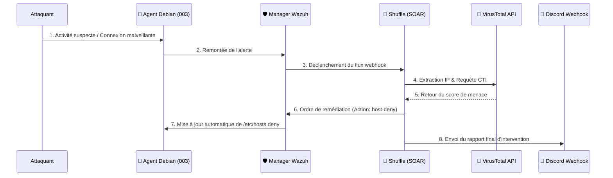
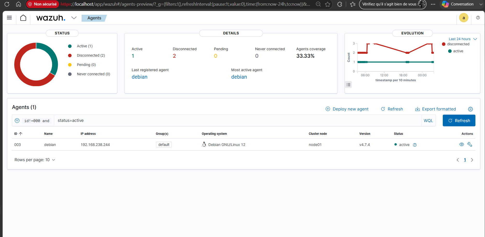
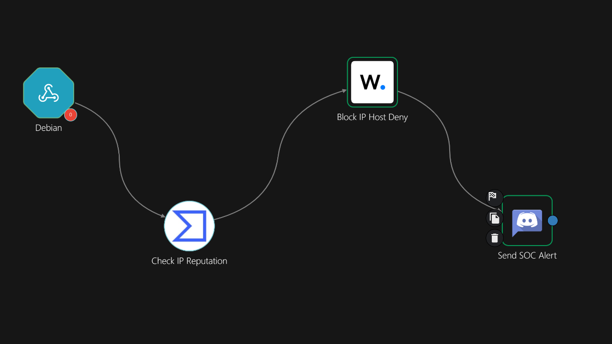
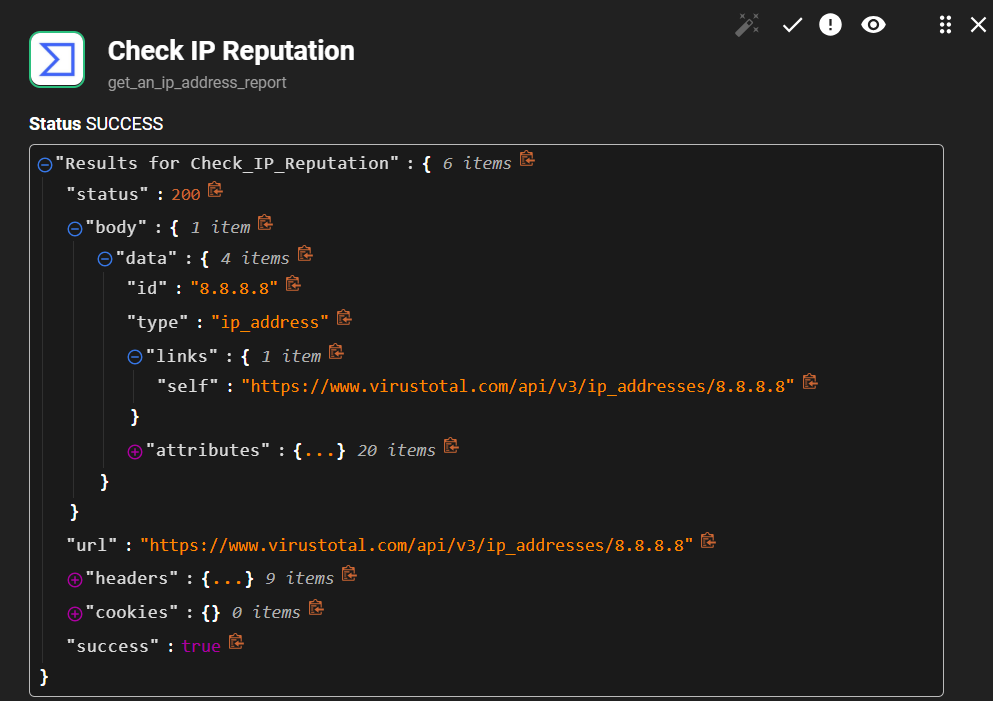
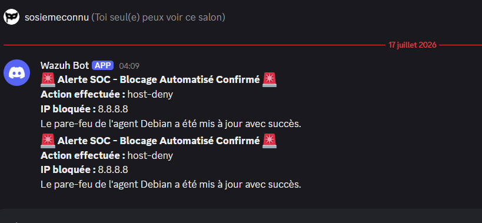
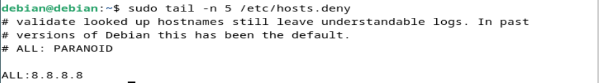

# 🛡️ Pipeline SOAR : Remédiation Automatisée (Wazuh, Shuffle, VirusTotal, Discord)

## 🎯 Objectif du Projet
Ce projet démontre la mise en place d'une chaîne complète de réponse à incident (SOAR) automatisée. L'objectif est de détecter une activité réseau suspecte sur un agent Linux, d'enrichir l'alerte via de la Cyber Threat Intelligence (CTI), et d'exécuter une remédiation dynamique (blocage IP) sans intervention humaine, tout en notifiant l'équipe de sécurité.

## 🛠️ Stack Technique
* **Infrastructure & Déploiement :** Docker, Docker Compose
* **SIEM / XDR :** Wazuh (Manager & Agent)
* **SOAR :** Shuffle
* **CTI :** API VirusTotal v3
* **OS Cible :** Debian Linux
* **Communication :** API REST, Webhooks, JSON
  
## ⚙️ Architecture et Workflow

Le flux de données est orchestré par **Shuffle** et suit ces 5 étapes critiques :

1. **Détection :** L'agent Wazuh remonte une alerte de sécurité au Manager.
2. **Enrichissement (CTI) :** Shuffle interroge l'API **VirusTotal** pour analyser l'adresse IP source et obtenir un score de malveillance.
3. **Orchestration :** Formatage des données et ciblage précis de l'agent.
4. **Remédiation Active :** Appel API vers le Manager Wazuh pour déclencher le script natif `host-deny` directement sur la machine compromise.
5. **Notification :** Envoi d'un rapport de situation formaté vers un Webhook **Discord**.

## 📸 Démonstration en images

> **Figure 1 :** Interface du Manager Wazuh confirmant la connexion et la supervision de l'agent Debian cible (ID: 003).

> **Figure 2 :** Flux d'orchestration global dans l'interface Shuffle, de la détection à la notification.

> **Figure 3 :** Enrichissement de l'alerte via l'API VirusTotal pour confirmer la malveillance de l'IP avant remédiation.

> **Figure 4 :** Succès de l'intégration du Webhook avec réception de l'alerte formatée sur le salon SOC.

> **Figure 5 :** Résultat de l'Active Response sur l'agent Debian : l'IP cible est bloquée dynamiquement au niveau du système.

## 🔬 Défis techniques et Résolutions
Lors de la mise en place de ce pipeline, plusieurs subtilités liées à l'API Wazuh et à l'exécution de l'Active Response ont été surmontées :
* **Réseau et Conteneurisation :** Déploiement complet de l'architecture via Docker et gestion des configurations réseau (notamment les réseaux host-only) pour assurer la bonne communication et le routage des alertes entre les conteneurs isolés et l'agent Debian.
* **Formatage strict du Payload :** L'injection de la variable contenant l'IP depuis Shuffle vers Wazuh a nécessité une structuration JSON rigoureuse : `{"data": {"srcip": "<ip>"}}`.
* **Conflit d'Arguments :** Pour utiliser le script natif `host-deny`, il a fallu s'assurer de ne passer aucun argument additionnel dans l'appel API afin d'éviter les erreurs d'exécution (`cannot unmarshal object`).
* **Ciblage de l'Agent :** Ajout du paramètre `Agents_list` pour cibler spécifiquement l'ID de la machine compromise, évitant ainsi un broadcast inutile de l'Active Response à l'ensemble du parc.

---

## 👨‍💻 À propos du projet et de l'auteur

Ce laboratoire technique a été développé par **Max Dingao**, actuellement en Master 1 Cybersécurité et Système d'Information à l'INSA Hauts-de-France. 

Il vient s'ajouter à mon portfolio technique, en complément de mon projet d'**Assistant RAG hybride et local pour SOC**. L'objectif de ces travaux est de maîtriser de bout en bout l'architecture défensive et l'automatisation. 

Je suis activement à la recherche d'une **alternance (Master 2) en Cybersécurité ou DevOps pour la rentrée de septembre 2026**.

